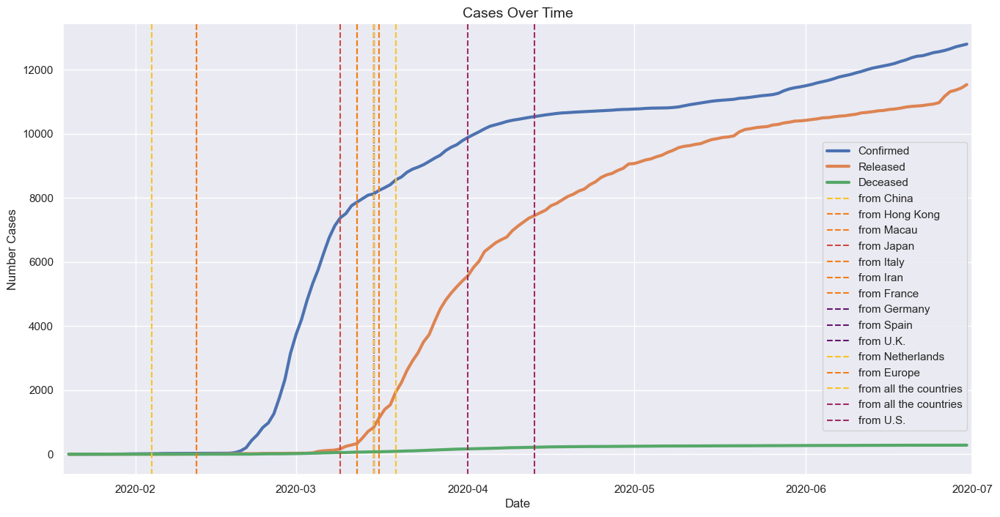

# COVID-19 Analysis

## Introduction
Analyze of [Kaggle](https://www.kaggle.com/datasets/kimjihoo/coronavirusdataset) Covid-19 dataset from
South Korea in 2020. We will clean the data by performing some manipulation with it, changing datatypes, removing some 
features and perform exploratory analysis. We will also check how many patients registered, who was the first person 
who got infected, find what age groups sick more often and how government try to stop the spreading.

## Data Description
<ol>
    <li>Case.csv - Data of COVID-19 infection cases</li>
    <li>PatientInfo.csv - Epidemiological data of COVID-19 patients</li>
    <li>Policy.csv - Data of the government policy for COVID-19</li>
    <li>Region.csv - Location and statistical data of the cities, regions and all South Korea</li>
    <li>SearchTrend.csv - Trend data of the keywords searched in NAVER which is one of the largest portals</li>
    <li>SeoulFloating.csv - Data of floating population in Seoul</li>
    <li>Time.csv - Time series data of COVID-19 status</li>
    <li>TimeAge.csv - Time series data of COVID-19 status in terms of the age</li>
    <li>TimeGender.csv - Time series data of COVID-19 status in terms of gender</li>
    <li>TimeProvince.csv - Time series data of COVID-19 status in terms of the Province</li>
    <li>Weather.csv - Data of the weather in the regions</li>
</ol>

## Data Preparation

Shape file of countries in the world downloaded from [NaturalEarthData](https://www.naturalearthdata.com/downloads/10m-cultural-vectors/).

Importing libraries to the notebook.
```commandline
%matplotlib inline

import matplotlib.pyplot as plt
import pandas as pd
import numpy as np
import seaborn as sns
import geopandas as gpd
import random
import scipy.cluster.hierarchy as sch

from datetime import timedelta
```

Set up styles for plotting.
```commandline
# Warm palette
custom_palette = sns.color_palette("Blues_r")
sns.set_palette(custom_palette)

# Activating white grid
sns.set(style="whitegrid")

# Default figure size for all Seaborn plots
sns.set(rc={'figure.figsize': (10, 6)})

# Set up colors for pie plot
colors = sns.color_palette("Set2")
```

```commandline
# Add South Korea boundary
south_korea_shp_path = "border/ne_10m_admin_0_countries_kor.shp"
```

Now we can import the data to the notebook, read it from `.csv` and convert it to the data frame. Base by dataset provider we already know that data contains of 11 different `.csv` files. Let's provide the path to the data which we will be using and load it to the data frame.
```commandline
# Providing path
data_path = "data/"

# Importing datasets
df_case = pd.read_csv(f"{data_path}/Case.csv")
df_patientinfo = pd.read_csv(f"{data_path}/PatientInfo.csv")
df_policy = pd.read_csv(f"{data_path}/Policy.csv")
df_region = pd.read_csv(f"{data_path}/Region.csv")
df_time = pd.read_csv(f"{data_path}/Time.csv")
df_timeage = pd.read_csv(f"{data_path}/TimeAge.csv")
df_timegender = pd.read_csv(f"{data_path}/TimeGender.csv")
df_timeprovince = pd.read_csv(f"{data_path}/TimeProvince.csv")
```

## Data Cleaning

### PatientInfo
Convert features of data set.
Convert data type.
We can see that our data consists of a lot of **NaN** values, this will limit out analysis, but they do not affect each other features, if we need to fix them we'll do it as we go along. Also, we see some strange deviation in contact_number, we need to change some values inside, because base by logic there should not be **negative contacts** and also one person cannot infect **more than ten thousand** or even a million people. Data can be corrupted while it was prepared. We're going to fix it by **removing these rows**.
Remove misleading values less than 0 and more than 10_000 from data set.

### Case
Check information of dataset.
Latitude and longitude should be numeric values, we can change it by converting these features.
Change dtypes of latitude and longitude.
As we know only 4 features consists of numeric value. First one **case_id**, we know this feature is unique for every case, so it will not give us any important information. Second thing is **confirmed**, these values have quite big standard deviation and maximum value, we know that some cases can have only few or zero confirmed cases while other can have thousands, we assume these high numbers as an outliers, but we will use them as legit values without modifying them. And lastly **latitude, longitude** these values will help us to plot spatial data.

### TimeAge
Check information of data set.
We can **change data type of date** and also **remove unnecessary time column**.
Drop column time.
Change datatype of date.

### TimeGender
Check data types.
We can **change data type of date** and also **remove unnecessary time column**.
Drop column time.
Change datatype of date.

### Time
Check data types
We can **change data type of date and remove time feature**.
Change datatype of date
Remove time feature

### Policy
Check data types.
We can drop some unnecessary columns and modify **start_date** data type.
Drop columns which will not be used.
Change datatypes of data.

### Region
Check data types.
Check data set from statistical view.
Remove Korea row as we don't need overall data.
Rename some columns.

## Exploratory data analysis

### EDA PatientInfo
<ul>
    <li><b>Who is the first person to get Covid-19?</b></li>
    <li><b>How people get infected?</b></li>
    <li><b>Which genders and age groups tend to get virus more often?</b></li>
</ul>

Number of patients: 5162
Number of unique cases: 52

We can see that first person was **women in here 30s** from China. She got confirmed in **2020-01-20** from overseas inflow. While the first individual from **Korea is man in his 50s** who get confirmed of infection in **2020-01-23** by also overseas inflow. As we know we have a lot of missing values in this dataset, which will limit out analysis, still let's proceed further and check top 5 most infection cases.

<p align="center">
  
</p>

We see that most of the infections come from **Contact With Patient** it takes **3680 contacts - 30.3%** of top cases, as we know **Covid - 19** spreads through contacting with other persons, as the distribution show, other top infections are in gathering place like **Church** combining them both we can see that it is taking **3782 contacts- 31.1%** as people tend to sit next to each other in churches. **Etc** cases which is not define take **2559 contacts - 21.2%**, also **Overseas Inflow** take big piece in out chart **2119 contacts - 17.5%**, assuming a lot of people get infected traveling through countries. Let's see distribution how much contacts one person have, **from statistical view contact_number**  show that most of the contacts goes lower than **50 contacts per people** will put threshold as 50 people, it's very low chance that one person can contact more than 50 people. All values higher than 50 can be assumed as an outlier.

<p align="center">
  
</p>

As reflected **the highest number of contacts goes from 0 to 3, from there we see contacts decreasing**. At about **8 contacts both male and female have similar numbers**. Men tend to contact less than women, there are cases there people contacted for than 10 people, we can assume they can be working a contact job or possible they are still going to schools or university. Now we can demonstrate the contact number distribution over age and sex.

<p align="center">
  
</p>

**Female tend to have more contact from start of 10s to end of 30s while men highs goes from start of 40s to end of 60s which show significant high contact number, only in the 50s both genres have almost the same contact numbers. We also see female children have more contacts over men while in the 90s huge opposite situation we have only male contacts, and for 100s we see no contacts for both genre, while individuals still got infected**.

### EDA Case

<ul>
    <li><b>Do people tend to get infected in groups or one by one?</b></li>
</ul>

Number of cases: 174
Number of unique cases: 81

<p align="center">
  
</p>

As shown **7851 contacts was group infection which is 68.9% of our data while 3544 individual infection from one person - 31.1%**, more than double of cases appear because people tend to attend in group activities, visit church, gym, clubs etc.

### EDA TimeAge

<ul>
    <li><b>How the virus distributes over different age groups?</b></li>
</ul>

Number of days: 121
Date period: 2020-03-02 - 2020-06-30
Total number of confirmed cases: 1261203
Total number of deceased cases: 25504

<p align="center">
  
</p>

As you see our data goes **from 2020-03-01 until 2020-07-01**, biggest confirmed cases start exploding from **2023-03-01 until 2020-03-08** then it start to go up smooth. At about **2020-03-18 80s get higher** and at **2020-03-29 50s also increase slightly**. At **2023-05-08 20s** start to get more confirmed cases and at about **2023-05-28** all age groups except **0s** also get steeper. We see that all people have similar chance to get Covid-19, mostly the youngest people who tend to be more active, who studying, working and spending more time socializing have more cases than older people.
<ul>
    <li>20s takes 27% of all cases</li>
    <li>0s takes about 1%</li>
    <li>80s takes 4%</li>
</ul>

<p align="center">
  
</p>

From this plot we see that **deceased grow mostly for older people** it start from **2020-03-01 and increase rapidly till 2020-03-28 for 80s people** but mostly for all people who are older than **60s it goes till about 2040-04-15**, than line starts to get smoother and stops climbing so much. For younger people who are from **30s to 60s most cases appear from 2020-04-01 till 2020-04-17** than line stops growing. For youngest people from **0s to 30s there are no cases at all**. People older than 50 years old have more chance to get deceased from Covid - 19.
<ul>
    <li>0s, 10s and 20s takes 0% of all cases</li>
    <li>30s, 40s and 50s takes less than 10%</li>
    <li>60s and 70s takes about 45%</li>
    <li>80s takes almost 48%</li>
</ul>

<p align="center">
  
</p>

As evidenced of danger for older people we see that **deceased over confirmed case ratio is way bigger to older than younger. We can assume that people older than 50 should avoid contacting with others, wash hands more often, cover faces with mask, they have bigger ratio to get sick and deceased**. 

### EDA TimeGender

<ul>
    <li><b>How the virus distributes over different genders?</b></li>
</ul>

Number of days: 121
Date period: 2020-03-02 - 2020-06-30

Confirmed cases of Males: 513727
Confirmed cases of Females: 747467
Deceased cases of Males: 13484
Deceased cases of Females: 12019

<p align="center">
  
</p>

As we can see **female have more confirmed cases over men while men have slightly more often deceased because of Covid-19**. 
Now we're going to reflect it in time period.

<p align="center">
  
</p>

As shown before **females tend to get Covid-19 more often than mens** we can see than from the beginning of date both genders spikes till **2020-03-10** than line starts to bend, other line bending can be seen at **2020-04-04** from this date cases start stabilizing. From **2020-05-08 men and 2020-05-07 women start to get more cases again**.

<p align="center">
  
</p>

As reflected both genders have very similar deceased numbers over time at about **2020-04-15 both genders start to stabilize and cases stop growing so rapidly, other date to mention is 2020-05-15 from here female cases have only few case increase while male still increasing**. 

### EDA Time

<ul>
    <li><b>How many people in the South Korea were affected by COVID?</b></li>
</ul>

We observe similarity in correlation between the variables **test and negative**. Additionally, a similar correlation pattern is identified between **confirmed and released**.  To gain a deeper understanding, let's further investigate and analyze these correlation values.

<p align="center">
  
</p>

As reflected two days **2020-02-20 and 2020-05-12** are most important. **First date show when cases start increasing second show vertical increase**. We also can see that **tests are close with negative cases and both of them have linear increase.** Now we are going to check confirmed and released cases over deceased.

<p align="center">
  
</p>

From line chart we see that **confirmed cases start bending horizontally 2020-04-07 but started to increase again from 2020-05-08**. From other hand **released cases increasing stably until 2020-06-05 from there cases start increasing way faster**.

<p align="center">
  
</p>

For deceased chart we see that at **2020-04-16 deceased number stop increasing so much and try to stabilize**.

### EDA Policy

<ul>
    <li><b>How the government deals with COVID?</b></li>
</ul>

<p align="center">
  
</p>

As we see most popular 3 policy types are **Education takes 24.6% of all dataset - 15 government policies, Immigration 24.6% - 15 government policies and Health 16.4% with 10 policies**. We can also check how policy distributes in different months.

<p align="center">
  
</p>

From chart, we see that in **March there was most of the policies - 21, as we know in this month the growth of cases growth rate was the biggest**. Let's see what government policy was declared overall. We will set the **threshold to 1, so we will put all policies to "Others" if they appear only once**, otherwise we will show them.

<p align="center">
  
</p>

As shown **Special Immigration Procedure and School Opening With Online Class** policies used most often, basically country stop immigration to prevent new cases from other country's and also started online classes, so most of the youngest people stop spreading virus. Now we proceed further and see how most often declared government policy impact cases.

<p align="center">
  
</p>

<ul>
    <li>We may see that Infectious Disease Alert was already started before first cases. </li>
    <li>Alert Level 1 (Blue) was initiated 01-03. </li> 
    <li>Level 2 (Yellow) right when first confirmed case was registered </li> 
    <li>Level 3 (Orange) when 100 test was made </li>
    <li>Level 4 (Red) when confirmed cases started to spike.</li>
</ul>

<p align="center">
  
</p>

<ul>
    <li>Immigration procedure was started February 4 after Level 3 alert, first ones was made for China, Hong Kong and Macau, then from March 9 when confirmed cases started to stabilize and release cases started to rise until March 19 all countries was added to this procedure. </li>
    <li>At April 1 Mondatory 14-day Self-Quarantine policy initiated for all countries and at March 13 Self-Quarantine and Diagnostic Tests was initiated for U.S.</li>
</ul>

<p align="center">
  
</p>

<ul>
    <li>For Health policy on February 4 Emergency Use Authorization (EUA) was granted - it is special permission allowing the use of a diagnostic test before approval process. This policy often granted quickly to respond for health crises. Over all time 5 (EUA) was granted overall. </li>
    <li>Also on February 26 Drive-Through Screening Center was established to more quickly and efficiently check cases by Local Governments but on March 4 it was Standard Operating Procedure overall. </li>
    <li>At February 27, 3th and 4th EUA Mask Distribution policy granted right besides Mask Distribution. </li>
    <li>Other Mask Distribution is 5-day Rotation System which was established on March 9 to stabilize mask and medical supply distribution. </li>
    <li>Lastly on May 28 Government extends tightened quarantine measures in South Korea capital Seoul in Metro area. </li>
</ul>

###  EDA Region And Time Province

<ul>
    <li><b>Does education level have any impact to virus?</b></li>
</ul>

<p align="center">
  
</p>

As detailed Covid-19 cases have almost 0 correlation to education, we could think that people who are more educated tend to look after them self more, wash hands more often, wear masks etc. But from plot we see that virus break through so fast and efficient that nobody was preparing and didn't know how to fight with the virus. Besides a virus we see strong correlation between **elementary schools, kinder garden, university and nursing homes** the more educated people the more place to get education they need, also the health need increase. Also, we see positive correlation with **elderly being alone with population ratio** which is obvious that older individuals is more likely to live alone. One more thing we can see is elderly ratio over the region and negative academy ratio over other education places, the ratio decrease the more education places exists, people tend to pick academy over other places.

<p align="center">
  
</p>

We see that academies scatter across all South Korea, but most of them situated near the Special City / Metropolitan City / Province marked with red cross. People tend to pick Academy over other institution because it's cheaper and easier to get a place in it.

<p align="center">
  
</p>

As we see most elderly people live in South - South West of country, base by population and alone ratio they live is less populated zones. Meanwhile, younger people lives near bigger cities and capital. Special City / Metropolitan City / Province marked with red cross.

### Hierarchical Clustering

<p align="center">
  
</p>

As we see optimal cluster size is 5, now we can train the Hierarchical Clustering model on the dataset.

<p align="center">
  
</p>

From scatter plot we see 5 clusters, this suggests that virus could spread in different ways over South Korea. Also, more people are being tested which show increasing confirmed cases being detected so virus is spreading more quickly infecting more and more. 

### Random Forest Classification

We train the machine learning model with 0.82 accuracy, providing people age group and confirmed cases number we can predict deceased number.

## Summary

<ol>
    <li>First person who get Covid-19 was 50s man who got confirmation of virus in 2020-01-23</li>
    <li>Most of the people got infected by contacting with patients and in meeting places.</li>
    <li>Most often, a person comes into contact with 3 other persons, but the number can rise to 8, less to 20 or 30.</li>
    <li>Female tend to contact more from 10s to 30s while men from 40s to 60s, at 100s we don't see contacts at all.</li>
    <li>Group infection takes 68.9% of our data leaving 31.1% to individual one to one contact.</li></li>
    <li>In Confirmed Cases:
        <ul>
            <li>20s take 27% of all cases.</li>
            <li>while 0s take about 1%.</li>
            <li>80s - 4%.</li>
        </ul>
    </li>
<li>In Deceased cases:
    <ul>
        <li>0s, 10s and 20s takes 0%.</li>
        <li>30s, 40s and 50s takes less than 10%.</li>
        <li>60s and 70s takes about 45%.</li>
        <li>80s takes almost 48%.</li>
    </ul>
<li>Virus way danger to older people than younger.</li>
<li>Female takes about ~60% of all cases.</li>
<li>2020-02-20 and 2020-05-12 both dates show high vertical increase over cases.</li>
<li>Confirmed cases start bending horizontally 2020-04-07 but started to increase again from 2020-05-08.</li>
<li>Released cases increasing stably until 2020-06-05 from there cases start increasing way faster.</li>
<li>2020-04-16 deceased number stop increasing so much and try to stabilize.</li>
<li>Education takes 24.6% of all dataset - 15 government policies, Immigration 24.6% - 15 government policies and Health 16.4% with 10 policies.</li>
<li>In March there was most of the policies - 21.</li>
<li>Special Immigration Procedure and School Opening With Online Class policies used most often.</li>
<li>
    <ul>
        <li>Infectious Disease Alert was already started before first cases.</li>
        <li>Alert Level 1 (Blue) was initiated 01-03.</li>
        <li>Level 2 (Yellow) right when first confirmed case was registered.</li>
        <li>Level 3 (Orange) when 100 test was made.</li>
        <li>Level 4 (Red) when confirmed cases started to spike.</li>
    </ul>
</li>
<li>
    <ul>
        <li>Immigration procedure was started February 4 after Level 3 alert, first ones was made for China, Hong Kong and Macau, then from March 9 when confirmed cases started to stabilize and release cases started to rise until March 19 all countries was added to this procedure.</li>
        <li>At April 1 Mondatory 14-day Self-Quarantine policy initiated for all countries and at March 13 Self-Quarantine and Diagnostic Tests was initiated for U.S.</li>
    </ul>
</li>
<li>
    <ul>
        <li>For Health policy on February 4 Emergency Use Authorization (EUA) was granted - it is special permission allowing the use of a diagnostic test before approval process. This policy often granted quickly to respond for health crises. Over all time 5 (EUA) was granted overall.</li>
        <li>Also on February 26 Drive-Through Screening Center was established to more quickly and efficiently check cases by Local Governments but on March 4 it was Standard Operating Procedure overall.</li>
        <li>At February 27 3th and 4th EUA Mask Distribution policy granted right besides Mask Distribution.</li>
        <li>Other Mask Distribution is 5-day Rotation System which was established on March 9 to stabilize mask and medical supply distribution.</li>
        <li>Lastly on May 28 Government extends tightened quarantine measures in South Korea capital Seoul in Metro area.</li>
    </ul>
</li>
<li>People who are more educated generally have better health habits, like washing hands and wearing masks. It might be expected that they get sick less often, but this isn't always the case.</li>
<li>Places where elderly ratio higher have bigger elderly alone ratio.</li>
<li>We see that academies scatter across all South Korea, but most of them situated near the Special City / Metropolitan City / Province.</li>
<li>Most of older people live in South - South West of country. Meanwhile, younger people lives near bigger cities and capitals.</li>
</ol>


For the plan of stooping the virus we have some key aspects. 

* First of all we know that based by dataset most of the confirmed cases are based on young people, who spend time on school, university, gyms where the most group contacts appeared. Mostly one patient can contact from 0 to 3 peoples and number can rise to 8, sometimes to 20 or 30, so if one person got infected, while traveling from home to school he already can contact a lot of people. So first idea of stooping the virus would be gathering place close procedure, for example opening online classes could stop the spreading. Group gathering should be stop to, for example churches or gyms, where people tend to go from different city zones, this way virus would be stopped from spreading over different city regions. 

* Another aspect we see that older people tend to get deceased more often than younger, we already know that younger people are more active, travel more than older, so young people gathering, traveling would decrease chance to infect others especially older people. We know that most of younger people live near the biggest cities, so all procedures need to be started in those cities. 

* Based by government policy best way to improve situation is to close immigration from other countries while the situation in main country is not controlled, make self isolation for people who got infected or have contact with infected. Also provide mask and medicine over people, so they can start testing them self and start healing.

## License
This project is licensed under the MIT License - see the **LICENSE** file for details.

## Contact Information
[Email](ricardas.poskrebysev@gmail.com)
[LinkedIn](https://www.linkedin.com/in/ri%C4%8Dardas-poskreby%C5%A1evas-665207206/)
[GitHub](https://github.com/Riciokzz)
